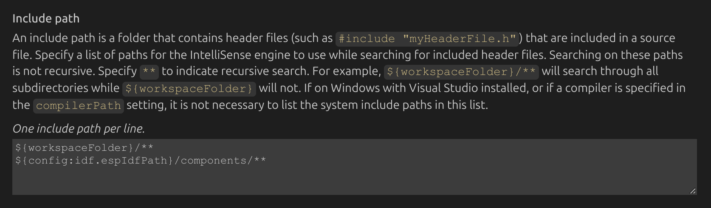

# Jarvis \(E-Bike central management system\)

## Introduction

Built for:
- Far-driver motor controller \(南京远驱控制器\)
- AntBMS \(蚂蚁保护版\)

Features:
- Reads telemetry data from motor controller & BMS system
- Anti-theft & BLE unlocking
- SoftAP with a web server for easy management
- GPS tracking
- IoT \(4G networking\) for remote management

This project is based on the ESP32S3 board. Although it should also work on other boards with some tweaks.
The system is actively used in my e-bike customization. I only recommend using this as a add-on and keep the
other systems such as the original odometer and anti-theft system as-is. You can hook this in parallel so that
it keeps the original hardware of the bike functional while provided added features \(just-in-case something
with the DIY solution fails\).

## Project structure

```
├── assets/                        Reference images and docs
├── CMakeLists.txt                 ESP-IDF project entry point
├── COPYING
├── LICENSE.txt
├── README.md                      Project overview and setup notes
├── build/                         Generated build artifacts (firmware, bootloader, configs)
├── build.sh                       Convenience wrapper for native build
├── build_esp32.sh                 Flash/build helper for ESP32 target
├── build_web.sh                   Front-end build script
├── components/                    ESP-IDF components (BT stack, NimBLE, utilities)
├── custom_partitions.csv          Partition table definition
├── dependencies.lock              ESP-IDF managed component lockfile
├── main
│   ├── CMakeLists.txt
│   ├── ble_service.cpp            BLE service implementation
│   ├── ble_service.h
│   ├── include
│   │   └── svelteesp32.h          Bridge header for Svelte/ESP integration
│   ├── jarvis_main.cpp            Application entry for ESP firmware
│   ├── services
│   │   ├── ble
│   │   │   ├── ble.cc             BLE service wiring
│   │   │   └── ble.hh
│   │   ├── can_bus
│   │   │   ├── can.cc             CAN bus orchestration
│   │   │   └── can.hh
│   │   ├── lte
│   │   │   ├── lte.cc             LTE modem orchestration
│   │   │   └── lte.hh
│   │   ├── web
│   │   │   ├── http_server.cc     HTTP server wiring
│   │   │   └── http_server.hh
│   │   └── wifi
│   │       ├── wifi.cc            Wi-Fi management
│   │       └── wifi.hh
│   └── telemetry                  Sensor and controller data
│       └── motor                  Far-driver motor telemetry interface
│           ├── motor_controller.cpp  Motor control logic
│           └── motor_controller.h
├── pytest_hello_world.py          Example automated test shim
├── sdkconfig                      Active ESP-IDF configuration
├── sdkconfig.ci                   CI-focused ESP-IDF configuration
├── sdkconfig.old                  Previous ESP-IDF configuration snapshot
└── web
    ├── package.json               Web client dependencies and scripts
    ├── pnpm-lock.yaml
    ├── src
    │   ├── App.svelte             Svelte front-end root component
    │   ├── app.postcss
    │   ├── main.ts                Svelte/Vite bootstrap
    │   └── svelte-shim.d.ts
    ├── public
    │   └── favicon.svg
    ├── dist/                      Bundled web assets (generated)
    ├── scripts
    │   └── ensure-svelte-shims.cjs
    ├── tailwind.config.cjs
    ├── tsconfig.json
    └── vite.config.ts
```

## How to Use

After cloning the repo, remember to also clone the submodules:

```
git submodule update --init --recursive
```

The repository includes helper scripts in the project root to streamline both the web build and the ESP32 firmware workflow.

Remember to setup the build folder first with:

```
idf.py set-target esp32s3
```

**Scripts**:

- `./build.sh` &mdash; Regenerates the web frontend and then rebuilds, flashes, and monitors the firmware in one step. Pass any of the firmware options below and they will be forwarded automatically.
- `./build_web.sh` &mdash; Installs dependencies (requires `npm` and `pnpm`), compiles the Svelte frontend, and regenerates `main/includes/svelteesp32.h`.
- `./build_esp32.sh [options]` &mdash; Handles the ESP-IDF toolchain setup, builds the firmware, and optionally flashes/monitors the device.

### ESP32 script options

- `--port <device>` &mdash; Serial port used by `idf.py flash/monitor` (defaults to `/dev/ttyUSB0`; override by exporting `PORT=/dev/ttyACM0` or passing the flag).
- `--no-flash` &mdash; Build only; skip flashing.
- `--no-monitor` &mdash; Skip the serial monitor after flashing.

The firmware scripts load ESP-IDF automatically by sourcing `. "$HOME/esp/esp-idf/export.sh"`. If your toolchain lives elsewhere, set `IDF_SETUP_CMD` to point at your export command, for example:

```bash
IDF_SETUP_CMD='source ~/esp-idf/export.sh' ./build_esp32.sh --no-monitor
```

### Build all

```
./build.sh
```

### Build ESP32 code

```
./build_esp32.sh
```

### Build frontend

```
./build_web.sh
```

## Development

### BLE \(Nimble\)

Recommended to take a look at the HID device implementation: `esp-idf/examples/bluetooth/esp_hid_device`.

I previously have ran into problems where the device would not show up on IOS, and even if it does, pairing does not
really work as expected. THe `esp_hid_device` example works perfectly and I think provides a very good foundation for
how to set up a BLE server on the ESP32 device.

Parts of the implementation in my code directly mimics or references the implementation. You can read the project files
inside of `services/ble`, I have made detailed comments and notes on the implementation.

Some of the BLE features include:
- BLE pairing
- IOS \(and Android?\) bluetooth auto-pairing
- Automatic unlocking via paired / authorized devices
- Telemetry updates via custom app
- Remote configuration
- Remote operation of the bike \(assuming that I get this far, implementing a CAN BUS into my bike and all that\)

### VS Code

If code hints and recommendations do not show up, remember to set the proper configuration for your C++ intellisense:



1. Open the Command Palette: Press `Ctrl + Shift + P` (Windows/Linux) or `Cmd + Shift + P` (macOS).
2. Edit C/C++ Configurations: Type "C/C++: Edit Configurations (UI)" and select it. This will open the C/C++ extension's configuration settings.
3. Configure Include Paths: Locate the "Include Path" section within the configuration for your active environment (e.g., "Win32", "Linux", "Mac").
4. Add the necessary paths to your ESP-IDF components and other relevant header directories.
    ```
    "${config:idf.espIdfPath}/components/**",
    "${config:idf.espIdfPathWin}/components/**", // For Windows
    "${workspaceFolder}/**"
    ```

    > If you have custom components or libraries, add their respective paths as well, using ${workspaceFolder} for project-relative paths.
5. Save the Configuration: Save the c_cpp_properties.json file.
6. Restart VS Code (Optional, but Recommended): Sometimes, a restart of VS Code can help refresh the IntelliSense engine and resolve the issue.

## Examples

## Technical support and feedback

Feel free to contact me at wjw_03@outlook.com for any issues or inquires. Please set the subject with the name
of this project and that it's from GitHub. I will try to get back to you ASAP.

Please also feel free to post issues and PRs.

## Copyright notice

For to use "as-is" for any non-commercial purposes. I do not concent to sharing the code to be used
for commercial purposes without contact me first.
